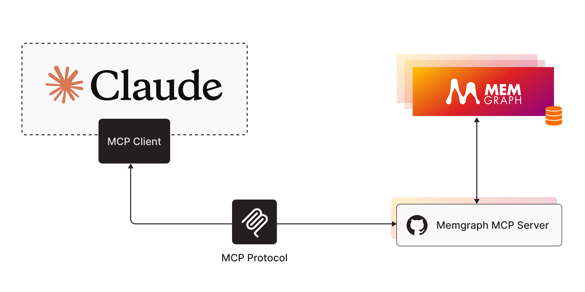

# 🚀 Memgraph MCP Server

[](https://smithery.ai/server/@memgraph/mcp-memgraph)

Memgraph MCP Server is a lightweight server implementation of the Model Context Protocol (MCP) designed to connect Memgraph with LLMs.



## ⚡ Quick start

> 📹 [Memgraph MCP Server Quick Start video](https://www.youtube.com/watch?v=0Tjw5QWj_qY)

### Installing via Smithery

To install Memgraph MCP Server for Claude Desktop automatically via [Smithery](https://smithery.ai/server/@memgraph/mcp-memgraph):

```bash
npx -y @smithery/cli install @memgraph/mcp-memgraph --client claude
```

### 1. Run Memgraph MCP Server

1. Install [`uv`](https://docs.astral.sh/uv/getting-started/installation/) and create `venv` with `uv venv`. Activate virtual environment with `.venv\Scripts\activate`. 
2. Install dependencies: `uv add "mcp[cli]" httpx`
3. Run Memgraph MCP server: `uv run server.py`.


### 2. Run MCP Client
1. Install [Claude for Desktop](https://claude.ai/download).
2. Add the Memgraph server to Claude config: 

**MacOS/Linux**
```
code ~/Library/Application\ Support/Claude/claude_desktop_config.json
```

**Windows**

```
code $env:AppData\Claude\claude_desktop_config.json
```

Example config:
```
{
    "mcpServers": {
      "mpc-memgraph": {
        "command": "/Users/katelatte/.local/bin/uv",
        "args": [
            "--directory",
            "/Users/katelatte/projects/mcp-memgraph",
            "run",
            "server.py"
        ]
     }
   }
}
```
> [!NOTE]  
> You may need to put the full path to the uv executable in the command field. You can get this by running `which uv` on MacOS/Linux or `where uv` on Windows. Make sure you pass in the absolute path to your server.

### 3. Chat with the database
1. Run Memgraph MAGE:
   ```
   docker run -p 7687:7687 memgraph/memgraph-mage --schema-info-enabled=True
   ```
   The `--schema-info-enabled` configuration setting is set to `True` to allow LLM to run `SHOW SCHEMA INFO` query.
2. Open Claude Desktop and see the Memgraph tools and resources listed. Try it out! (You can load dummy data from [Memgraph Lab](https://memgraph.com/docs/data-visualization) Datasets)

## 🔧Tools

### run_query()
Run a Cypher query against Memgraph.

## 🗃️ Resources

### get_schema()
Get Memgraph schema information (prerequisite: `--schema-info-enabled=True`).

## 🗺️ Roadmap

The Memgraph MCP Server is just at its beginnings. We're actively working on expanding its capabilities and making it even easier to integrate Memgraph into modern AI workflows. In the near future, we'll be releasing a TypeScript version of the server to better support JavaScript-based environments. Additionally, we plan to migrate this project into our central [AI Toolkit](https://github.com/memgraph/ai-toolkit) repository, where it will live alongside other tools and integrations for LangChain, LlamaIndex, and MCP. Our goal is to provide a unified, open-source toolkit that makes it seamless to build graph-powered applications and intelligent agents with Memgraph at the core.
